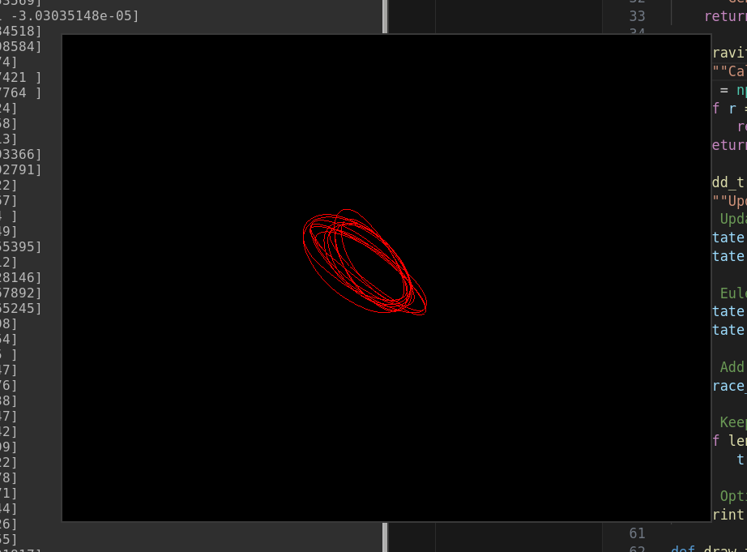
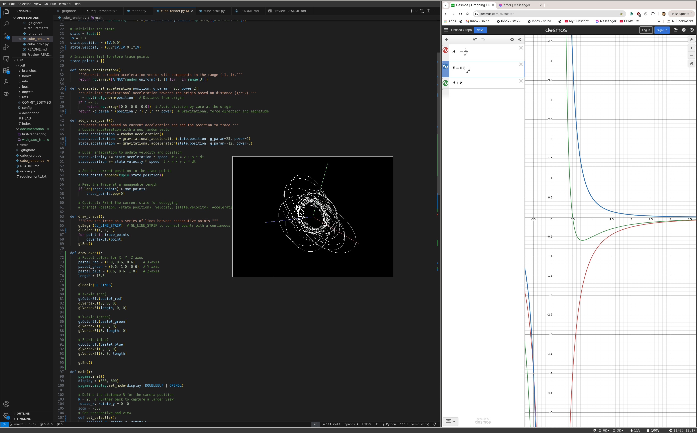

# Line

## 11/03
I want to animate a line tracing itself out, I think it will look pretty.

Here is my first pass, I used used a particle like physics model, orbiting the origin dependent on gravity plus acceleration. It is too orbit like, also there is some clipping glitch somewhere.

## 11/04

I figured out orbit controls in pygame + pyopengl. This makes me trumendously happy, and thank goodness I dont have to do anything related to three js.

## 11/10

This has been cool so far but I decided that it must be done in 3js so that I can serve it on a website. A python program is neat but you can't distribute that to people so 3js it is.

You can launch the dev environment via `npx vite` and it animates nicely. I like it.