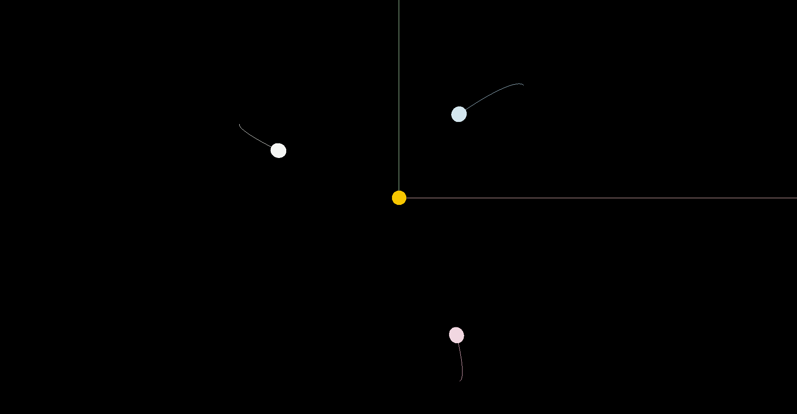
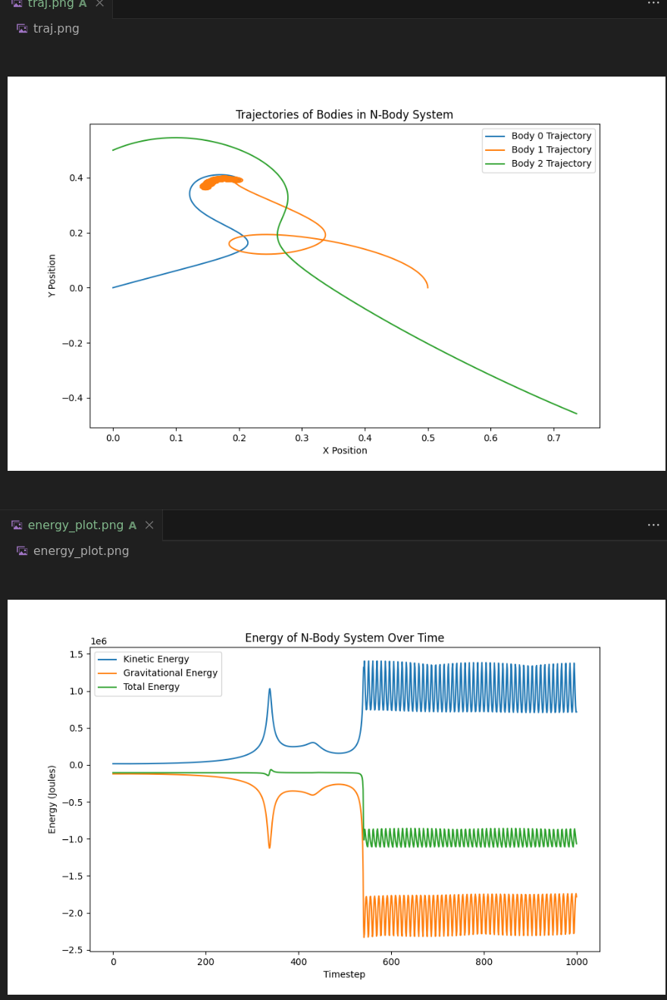
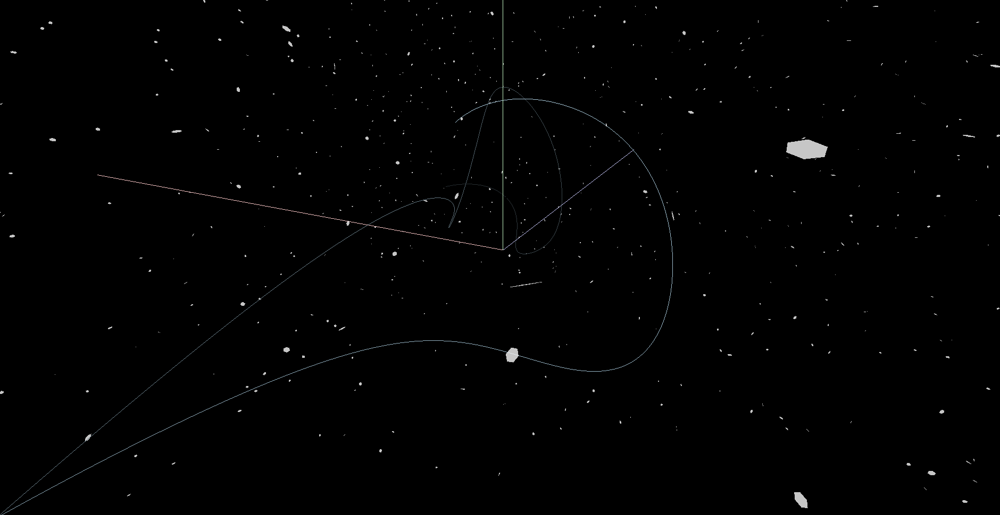
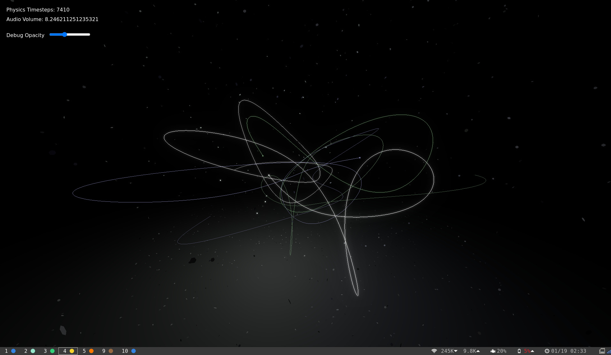
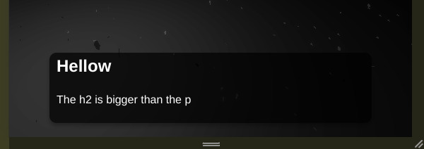
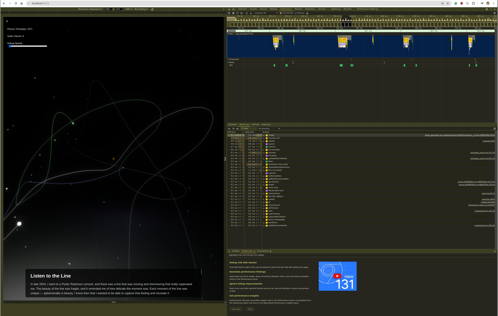

# Line

## 11/03
I want to animate a line tracing itself out, I think it will look pretty.

Here is my first pass, I used used a particle like physics model, orbiting the origin dependent on gravity plus acceleration. It is too orbit like, also there is some clipping glitch somewhere.


## 11/04

I figured out orbit controls in pygame + pyopengl. This makes me trumendously happy, and thank goodness I dont have to do anything related to three js.


## 11/10

This has been cool so far but I decided that it must be done in 3js so that I can serve it on a website. A python program is neat but you can't distribute that to people so 3js it is.

You can launch the dev environment via `npx vite` and it animates nicely. I like it.

## 11/11

I've taken the time to basically create an orbit simulation. One theory I had to make it look better was to make sure the whole system started with a nonzero angularmomentum. Where as if I randomly set it across a large sample, the angular momentum would be near zero sometimes. It looks nice.



But I think the real issue is actually energy. It is too easy to "eject" a few bodies out to infinity because it will have positive energy.
I think I will try implementing a system where energy is capped at some small negative value. I think I can implement this by saying, if an interaction would increase a bodies energy over the limit, do not transfer the energy. This should also prevent a body from having all of its energy robbed.

---

So I implemented an energy limiting. I made a slight algorithimic change to, if you are over the energy limit, and an interaction would increase the energy further, don't do the interaction. I felt like I was still seeing weird things though so I printed total system energy and it was not constant. I will have to look at this deeper. It looks like energy
isn't constant even with energy limiting off.

Nonetheless the graphics are cool and we aren't launching projectiles out of orbit!

## 11/12

It turns out that the concept of an energy limit, or a speed limit on the particles is deeply non physical, since this would let it travel into an area of lower gravitational potential without accelerating its KE. This leaves us with the potential for getting trapped in lower energy states as we enter a very tight orbit.



I think my next plan for a cool animation would be some sort of:

Faux drag force making sure we never accelerate off into the distance, and then an energy balancer. If the system loses too much energy add a bit more in. This should put us in stable equilibrium but not send us to infinity.

Here is my final animation without energy limiting:


## 11/24

Today I added snow, it is a bit cheap, it is just a hexagon (circle with 6 points). I think the snow looks nice. I also hid the other bodies driving the physics, and I really like how natural and alive that one line looks.

I tried increasing the line thickness but I couldn't get it to work faster so skipped ahead to the snow.



## 11/26

I made the light follow the line.


## 11/28

I am trying to work on bloom since I think that will help make the light itself more visceral

https://discourse.threejs.org/t/how-to-get-selective-bloom-to-work-without-layers/57728
https://discourse.threejs.org/t/selective-bloom-not-working-in-react-function-with-vanilla-js-wrapped-in-useeffect/42767/3
https://discourse.threejs.org/t/effectcomposer-unrealbloompass-is-ruining-my-whole-render-thing/45253

I ended up using an UnrealBloomPass.

## 12/XX

I tried doing more work with pavucontrol and audio sinks and I have decided that the scope of this is too large.
I will be happy playing a canned mp3 while the animation runs, so I shall do that.

I added audio using just a stored mp3. I used this site and it worked pretty well.
```
https://cnvmp3.com/v3
```

## 01/17

Today I want to link the project to Vercel and a real domain.

I registered listentotheline.com on cloud flare because that was the cheapest.

I also considered names like: wherewillwegonow.com or fallingintoorbit.com, or astheworldfallsdown.com,
but I think listentotheline flows nicely and is self-descriptive of the project.

Vercel told me to use this?
https://github.com/magne4000/vite-plugin-vercel#readme

```
npm install -g vercel
npm i -D vite-plugin-vercel
npm install vite-plugin-vercel --save-dev
```

Note: A lot of things were broken because I didn't have `package.json` which seems to prevent me from having local node_modules so I kept running into a bunch of dependency issues because I was using a global node modules. I'm surprised I made it this far.

```
npm start
npm install
```

```
npm install depcheck
depcheck
npm install eslint --save-dev
npx eslint --init
npx eslint "src/**/*.{js,ts,tsx}"
```

Depcheck was simpler lol.

## 01/18

It is now deployed to cloud flare! I had to fix the redirect loop by changing the SSL/TLS to full. A google search fixed this.

`https://vercel.com/guides/resolve-err-too-many-redirects-when-using-cloudflare-proxy-with-vercel`

---

Now I want to write out a list of things I want to do as I finalize this project.

- I want slider systems, something where you can realtime adjust the values of brightnesses and opacities.
  - I then also want to have the automatically orchestrated components to also change the slider positions.
- I want a sequence at the end where when the music gets more intense, it reveals the debug opacity slider and makes it more bright.
- I want some sort of sliding text (kinda like movie credits), that explains my rationale and why I wanted to make this project.
- About me, and contact me section

Bonus:
- Mobile experience
- Google Analytics
- The line is kinda like... too much like bresenham line lmfao. I should fix that.

EOD update:
- I have almost updated all the bodies to support the plumbing of a body context, but now I need to update the animation funtion to change the opacity over time.

# 01/19

I've got the slider plumbed through to control the visibility of the debug items. I really like this a lot, and I want to hide the slider until the later half of the song and autonomously control the slider vlaue. This might fight with the user.

I might make something where if the user interacts, it overrides...? Or I may just create a toggle on the mux that disables autonomous control... state seems hard.

Here's a screenshot with the slider.



# 01/22

Holy cow I have words at the bottom! I was struggling to get the format right, everything was showing up as if it was just <p>, but it turns out the reason it wasn't working was that I didn't define all the tags and classes and such in my styles file. Wow. That's wild. But glad I know now!



# 01/23

I had a bunch of trouble getting CSS to work, for example the real reason why h2 wasn't bigger than p was that I actually had tailwind css sneaking around in my `index.html`. I discovered this using inspect element. What a powerful tool. I have since doubled down on using tailwind css and so far it has been a good experience.

# 01/24

I used the performance tab of chrome to do a deep dive on why my stuff was slow. I didn't know how to use it, and after a YouTube tutorial holy cow this is so nice. WebDevs really have it nice. The tooling is just so good. It was really cool to have a flamegraph so easily accessible without having to install anything!

I found a few relics:
- I upped the number of physics updates per frame to try and eliminate gaps in my lines originally, this added a lot of compute overhead - I should just fix this a different way.
  - So to fix it, I went back to one physics update per frame.
- I had added hella snowflakes in order to make the snow look legit, but my GPT generated snowflake code was just terrible. I should have written it manually myself the first time haha.
  - I decreased the number of snowflakes drastically (by about 10x), I decreased the envelope they were rendered in significantly and time on ground to maintain density. People won't notice unless they zoom out, and I think that's a bit of an easter egg!
- I also got to decrease the total number of line points now that I am running fewer timesteps. Updating a giant array of opacities on the CPU sucked. I should really figure out how to move that to a shader some other time.
- Turned off console logging

Next to do is I really like the mobile pixelation effect. I want to figure out how to use WebGL render targets to try and implement that effect on desktop while maintaining size.


